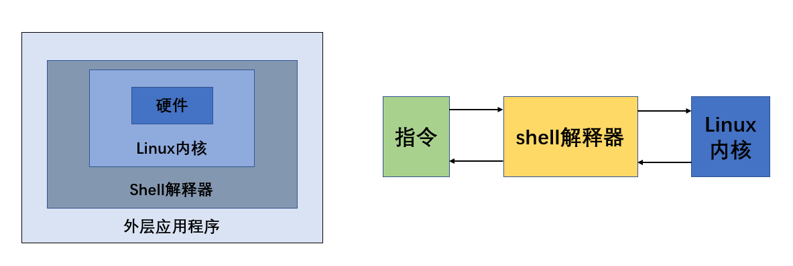

# shell

> Shell是什么
>
> Shell是一个命令行解释器，它为用户提供了一个向Linux内核发送请求，以便运行程序的界面系统级程序，用户可以用Shell来启动、挂起、停止甚至是编写一些程序。

**示意图**



## shell 脚本的执行方式

**脚本格式要求**

- 脚本以 `#!/bin/bash` 开头

- 脚本需要有可执行权限

**脚本的常用执行方式**

方式1（输入脚本的绝对路径或相对路径）

说明：首先要赋予`helloworld.sh`脚本的`+x`权限，再执行脚本

方式2（sh+脚本）

说明：不用赋予脚本+x权限，直接执行即可。

```shell
callmewenhao@ubuntu:~$ vim hello.sh
# 输入程序
#!/bin/bash
echo "hello, world!"

# 创建后并没有执行权限
callmewenhao@ubuntu:~$ ls -l
-rw-rw-r-- 1 callmewenhao callmewenhao   45 Mar 19 23:37 hello.sh
# 给拥有者-u添加执行权限
callmewenhao@ubuntu:~$ chmod u+x hello.sh
callmewenhao@ubuntu:~$ ls -l
-rwxrw-r-- 1 callmewenhao callmewenhao   45 Mar 19 23:37 hello.sh

# 执行
callmewenhao@ubuntu:~$ hello.sh  # 直接文件名不可以
hello.sh: command not found
callmewenhao@ubuntu:~$ ./hello.sh  # 相对路径运行
hello, world!
callmewenhao@ubuntu:~$ sh hello.sh  # sh + file.sh 运行，该命令不要求执行权限
hello, world!
```

### 注释

```shell
# 代表单行注释
# shell脚本的多行注释
:<<!  # 单独一行
内容
!     # 也单独一行
```

