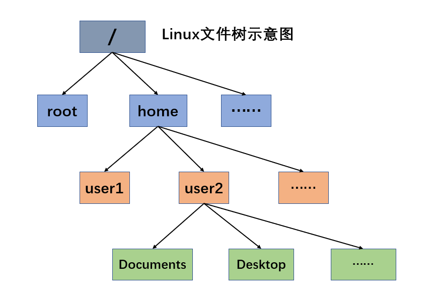
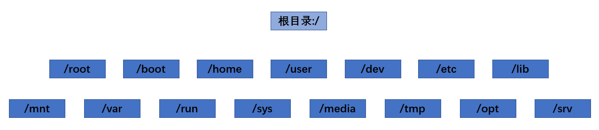

# Linux 目录结构

linux 的文件系统是采用级层式的树状目录结构，在此结构中的最上层是根目录"/"，然后在此目录下再创建其他的目录。深刻理解linux树状文件目录是非常重要的。

<p align="center"> </p>

**如果我们在某块磁盘A上（无其他分区）安装了Linux操作系统后，根目录下将会有此类默认的系统目录：**

```shell
$ ls /
bin  etc  lib  mnt  proc  run  tmp  var  boot  dev  home  root  srv  sys   usr
```

<p align="center"> </p>

- **/bin** [常用] （usr/bin、/usr/local/bin）
  
  是Binary的缩写，这个目录存放着最经常使用的命令
  
- **/sbin**（usr/sbin、 /usr/local/sbin）
  
  s就是Super User的意思，这里存放的是系统管理员使用的系统管理程序
  
- **/home** [常用]
  
  存放普通用户的主目录，在Linux中每个用户都有一个自己的目录，一般该目录名是以用户的账号命名
  
- **/root** [常用]
  
  该目录为系统管理员，也称作超级权限者的用户主目录
  
- **/lib** 

  系统开机所需要最基本的动态连接共享库，其作用类似于Windows里的DLL文件，几乎所有的应用程序都需要用到这些共享库

- **/etc** [常用]
  
  所有的系统管理所需要的配置文件和子目录，比如：安装mysql数据库后的配置文件，就放在这里
  
- **/usr** [常用]
  
  这是一个非常重要的目录，用户的很多应用程序和文件都放在这个目录下，类似与windows下的program files目录
  
- /**boot** [常用]

  存放的是启动Linux时使用的一些核心文件，包括一些连接文件以及镜像文件

- **/proc** 

  这个目录是一个虚拟的目录，它是系统内存的映射，访问这个目录来获取系统信息

- **/srv**

  service缩写，该目录存放一些服务启动之后需要提取的数据

- **/sys** 

  这是linux2.6内核的一个很大的变化。该目录下安装了2.6内核中新出现的一个文件系统**sysfs**

- **/tmp** 

  这个目录是用来存放一些临时文件的

- **/dev**
  
  类似于windows的设备管理器，把所有的硬件用文件的形式存储
  
- **/media** [常用] 

  linux系统会自动识别一些设备，例如U盘、光驱等等，当识别后，linux会把识别的设备挂载到这个目录下

- **/mnt** [常用]
  
  系统提供该目录是为了让用户临时挂载别的文件系统的，我们可以将外部的存储挂载在/mnt/上然后进入该目录就可以查看里的内容了
  
- **/opt**

  这是给主机额外安装软件所摆放的目录。如安装ORACLE数据库就可放到该目录下。默认为空

- **/usr/local** [常用]

  这是另一个给主机额外安装软件所安装的目录。一般是通过编译源码方式安装的程序

- **/var** [常用]

  这个目录中存放着在不断扩充着的东西，习惯将经常被修改的目录放在该目录下。比如各种日志文件

