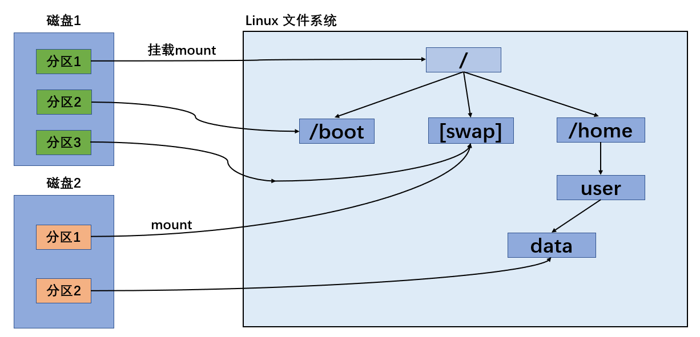

## Linux 磁盘分区机制

### 原理介绍

Linux 来说无论有几个分区，分给哪一目录使用，它归根结底就只有一个根目录，一个独立且唯一的文件结构，Linux 中每个分区都是用来组成整个文件系统的一部分。

Linux采用了一种叫“载入”的处理方法，它的整个文件系统中包含了一整套的文件和目录，且将一个分区和一个目录联系起来。这时要载入的一个分区将使它的存储空间在一个目录下获得。

**示意图：**

<p align="center">  </p>

### 硬盘说明

Linux硬盘分**IDE硬盘**和**SCSI硬盘**，目前基本上是**SCSI硬盘**

对于IDE硬盘，驱动器标识符为`hdx~`，其中`hd`表明分区所在设备的类型，这里是指IDE硬盘了。

`x`为盘号（a为基本盘，b为基本从属盘，c为辅助主盘，d为辅助从属盘）

`~`代表分区，前四个分区用数字1到4表示，它们是主分区或扩展分区，从5开始就是逻辑分区。

例：`hda3`表示为第一个IDE硬盘上的第三个主分区或扩展分区，`hdb2`表示为第二个IDE硬盘上的第二个主分区或扩展分区。

对于SCSI硬盘则标识为`sdx~`，SCSI硬盘是用`sd`来表示分区所在设备的类型的，其余则和IDE硬盘的表示方法一样。例如，下图表示：SCSI硬盘a盘，分有1、2、3个分区，分别挂载到了：`/boot, swap, / `


**查看所有设备挂载情况**

命令：`lsblk` 或者 `lsblk -f`

```shell
callmewenhao@ubuntu:~$ lsblk
NAME   MAJ:MIN RM   SIZE RO TYPE MOUNTPOINT
sda      8:0    0    30G  0 disk
├─sda1   8:1    0   512M  0 part /boot/efi
├─sda2   8:2    0     1K  0 part
└─sda5   8:5    0  29.5G  0 part /

callmewenhao@ubuntu:~$ lsblk -f
NAME   FSTYPE  LABEL UUID                                 FSAVAIL FSUSE% MOUNTPOINT
sda                  # 格式化后的磁盘发都会有一个UUID 
├─sda1 vfat          F640-5547                               511M     0% /boot/efi
├─sda2
└─sda5 ext4          207ea6a0-81d6-4462-ba33-02cb22cd1887   18.5G    31% /
```

