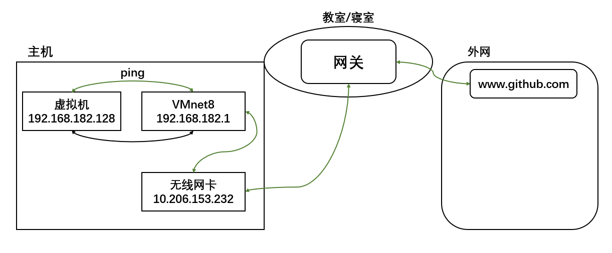

## 网络配置

### NAT网络示意图



**查看Linux中的网络配置**

`ifconfig`

```shell
callmewenhao@ubuntu:~$ ifconfig
ens33: flags=4163<UP,BROADCAST,RUNNING,MULTICAST>  mtu 1500
        inet 192.168.182.128  netmask 255.255.255.0  broadcast 192.168.182.255
        inet6 fe80::a1c6:43:f574:521c  prefixlen 64  scopeid 0x20<link>
        ether 00:0c:29:b0:2f:70  txqueuelen 1000  (Ethernet)
        RX packets 741  bytes 305012 (305.0 KB)
        RX errors 0  dropped 0  overruns 0  frame 0
        TX packets 348  bytes 50800 (50.8 KB)
        TX errors 0  dropped 0 overruns 0  carrier 0  collisions 0

lo: flags=73<UP,LOOPBACK,RUNNING>  mtu 65536
        inet 127.0.0.1  netmask 255.0.0.0
        inet6 ::1  prefixlen 128  scopeid 0x10<host>
        loop  txqueuelen 1000  (Local Loopback)
        RX packets 201  bytes 17277 (17.2 KB)
        RX errors 0  dropped 0  overruns 0  frame 0
        TX packets 201  bytes 17277 (17.2 KB)
        TX errors 0  dropped 0 overruns 0  carrier 0  collisions 0
```

**ping 测试主机之间网络连通性**

`ping 目标主机`

```shell
callmewenhao@ubuntu:~$ ping www.bing.com
PING china.bing123.com (202.89.233.101) 56(84) bytes of data.
64 bytes from 202.89.233.101 (202.89.233.101): icmp_seq=1 ttl=128 time=27.9 ms
64 bytes from 202.89.233.101 (202.89.233.101): icmp_seq=2 ttl=128 time=27.8 ms
64 bytes from 202.89.233.101 (202.89.233.101): icmp_seq=3 ttl=128 time=27.8 ms
64 bytes from 202.89.233.101 (202.89.233.101): icmp_seq=4 ttl=128 time=27.6 ms
```

## linux网络环境配置

**第一种方法：自动获取**

说明：登陆后，通过界面的来设置自动获取ip

特点：linux 启动后会自动获取IP，缺点是每次自动获取的ip地址可能不一样，这样不适合服务器


**第二种方法（指定ip）**

直接修改配置文件来指定IP，并可以连接到外网（程序员推荐）

编辑 ？

要求：将ip地址配置的静态的，比如：ip地址为`192.168.200.130`

### 设置主机名和hosts映射

**设置主机名**

为了方便记忆，可以给linux系统设置主机名，也可以根据需要修改主机名

指令`hostname`：查看主机名
修改文件在`/etc/hostname`指定修改后，重启生效

```shell
# 查看主机名
callmewenhao@ubuntu:~$ hostname
ubuntu

# 在该文件中修改主机名
callmewenhao@ubuntu:~$ vim /etc/hostname
# /etc/hostname文件内容
ubuntu  # 目前主机名是ubuntu
~
~
~
```

**设置hosts映射**

思考：如何通过主机名能够找到（比如ping）某个linux系统？

**windows**

在 `C:\Windows\System32\drivers\etc\hosts` 文件指定即可

例如： `192.168.182.128 ubuntu`

```shell
C:\Users\zhaowenhao>ping ubuntu

正在 Ping ubuntu [192.168.182.128] 具有 32 字节的数据:
来自 192.168.182.128 的回复: 字节=32 时间<1ms TTL=64
来自 192.168.182.128 的回复: 字节=32 时间<1ms TTL=64
来自 192.168.182.128 的回复: 字节=32 时间<1ms TTL=64
来自 192.168.182.128 的回复: 字节=32 时间<1ms TTL=64

192.168.182.128 的 Ping 统计信息:
    数据包: 已发送 = 4，已接收 = 4，丢失 = 0 (0% 丢失)，
往返行程的估计时间(以毫秒为单位):
    最短 = 0ms，最长 = 0ms，平均 = 0ms
```

**Linux**

在/etc/hosts文件指定

例如：`192.168.182.1 windows`

```shell
callmewenhao@ubuntu:~$ vim /etc/hosts
# 文件内容
127.0.0.1       localhost
127.0.1.1       ubuntu

# my Windows PC hostname
192.168.182.1   windows

callmewenhao@ubuntu:~$ ping windows
PING windows (192.168.182.1) 56(84) bytes of data.
64 bytes from windows (192.168.182.1): icmp_seq=1 ttl=128 time=0.380 ms
64 bytes from windows (192.168.182.1): icmp_seq=2 ttl=128 time=0.311 ms
64 bytes from windows (192.168.182.1): icmp_seq=3 ttl=128 time=0.901 ms
```

